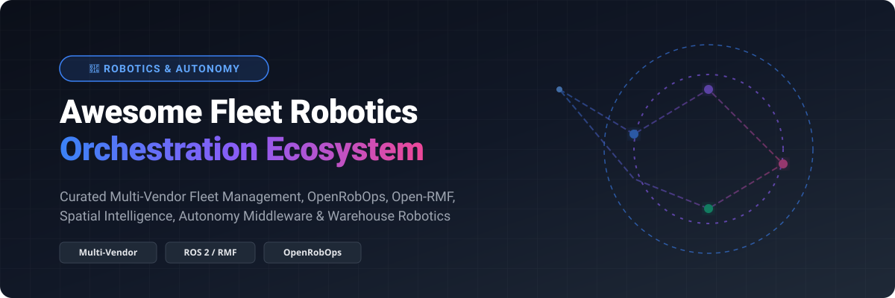

# Awesome-Fleet-Robotics-Orchestration 🤖 🚀

  

  
  
  
  
  
  

---

## 🌟 Top Fleet Robotics Orchestration Ecosystem 🤖 🌐

**Curated List of Commercial Fleet Management Platforms & Open-Source Orchestration Tools**  

*Focused on Multi-Vendor Interoperability, Mission Orchestration, Incident Management, Spatial Intelligence, VDA 5050 Protocols & Self-Hosted Fleet Managers* 🚀 📈

**Last updated: October 2026** 📅

---

### 📌 Overview & SEO Summary 🔍 ⚡

Welcome to the ultimate curated directory of **fleet robotics orchestration platforms**, **open-source fleet management frameworks**, **autonomous mobile robot (AMR) mission management**, and **multi-vendor robot orchestration tools**. Whether you are looking for enterprise-grade commercial solutions (such as *AWS IoT RoboRunner*, *Formant*, *Brain Corp*, *Vecna Robotics*, and *InOrbit*), or self-hostable open-source alternatives (like *ArduPilot*, *PX4 Autopilot*, *Open MCT*, *Autoware*, *ROS 2*, *Nav2*, *Webots*, *Open-RMF*, *MAVROS*, *OpenRobOps*, and *Foxglove Studio*), this ecosystem directory covers category leaders, spatial intelligence, VDA 5050 protocols, and privacy-respecting fleet operations. 🧠 🛡️

**Key Market Context:** 💡
- **OpenRobOps (ORO)** is the **leading open-source fleet management foundation**, released by InOrbit.AI as a contribution to the robotics community, providing a **production-grade fleet manager** that fits between ROS/ROS 2 and Open-RMF 🚀.
- **SVT Robotics SOFTBOT** has demonstrated **12x faster integration** than custom coding, deployed across **30 DHL Supply Chain sites** with plans for **100+ sites** in three years 📦.
- **Meili FMS** supports **multi-floor orchestration** and **vendor-agnostic integration** for heterogeneous AMR fleets 🏢.

---

## 📑 Table of Contents 📜

- [🏢 SaaS & Commercial Platforms](#-saas--commercial-platforms)
- [🔓 Open-Source GitHub Projects](#-open-source-github-projects)
- [🛠️ How to Contribute](#%EF%B8%8F-how-to-contribute)
- [📊 Star History](#-star-history)
- [🤝 Support & Sponsorship](#-support--sponsorship)
- [⚠️ Disclaimer](#%EF%B8%8F-disclaimer)

---

## 🏢 SaaS / Commercial Platforms 🏬 💳

> [!NOTE]
> **Market Size & Structure:** The global fleet robotics orchestration and robot management software market is estimated at **$1.8 Billion - $2.5 Billion** and is projected to reach **$6.2+ Billion** driven by widespread adoption in warehouse logistics, industrial automation, and material handling. The sector is **highly fragmented** with specialized niche leaders (Formant for observability, SVT for integration, Vecna/Brain Corp for physical AMRs, InOrbit for spatial intelligence), making interoperability standards like VDA 5050 and Open-RMF critical rather than a single "winner-take-all" platform. 📊 🌐

The fleet robotics orchestration market spans **hyperscaler fleet management services** (AWS IoT RoboRunner) that provide **infrastructure for multi-vendor integration**, **robot operations platforms** (Formant, InOrbit, Freedom Robotics) that focus on **observability, incident management, and spatial intelligence**, and **integration middleware** (SVT Robotics SOFTBOT) that accelerates **warehouse automation connectivity**. 🤖 🛠️

| SaaS / Commercial Platform | Company / Owner | Market Cap / Valuation / Total Funding | Standard Edition Starting Price | Free Tier / Free Trial Limits | Description |
| :--- | :--- | :--- | :--- | :--- | :--- |
| **[AWS IoT RoboRunner](https://aws.amazon.com/roborunner/)** ☁️ | Amazon | ~$2.0 Trillion Market Cap | **Service End-of-Support (March 2024)** | Service shut down on March 14, 2024; legacy AWS free tier provided 1,000 requests/month | **AWS-native fleet orchestration** — **Infrastructure for integrating multi-vendor robot systems** . **Central data repository and APIs** for building fleet management applications. **Shared space management** for orchestrating robots from different vendors . |
| **[Brain Corp](https://www.braincorp.com/)** 🧠 | Brain Corp | ~$500M - $1B Valuation ($193M Raised) | **Custom OEM subscription** | Custom enterprise demo upon request (no self-serve free trial) | **Autonomous robot fleet platform** — **37,000+ AMRs** and **250 billion square feet** covered autonomously . **BrainOS Sense Suite and Clean Suite** for inventory management and floor care. **50,000+ BrainOS-powered robots** worldwide . |
| **[Vecna Robotics](https://www.vecnarobotics.com/)** 🏭 | Vecna Robotics | ~$900M Valuation ($224M Raised) | **RaaS subscription model** (OpEx monthly billing based on throughput/uptime guarantees) | Enterprise workflow assessment and live demo upon request (no self-serve free trial) | **Material handling automation** — **Pivotal orchestration software** for fleet management, workflow management, and traffic control . **99.9% uptime** with **24/7 remote monitoring** . |
| **[Rocos](https://www.rocos.io/)** 🔵 | DroneDeploy (Acquired by Procore) | ~$845M Acquisition Value | **$4,188 / year** (DroneDeploy single-admin baseline) | 14-day full platform free trial | **Cloud robotics platform (acquired)** — **Acquired by DroneDeploy in 2021** and integrated into DroneDeploy's Ground Robotics platform . |
| **[SVT Robotics SOFTBOT](https://svtrobotics.com/)** 🔧 | SVT Robotics | ~$70M+ Total Funding | **Custom B2B SaaS annual subscription** | Custom interactive demo and proof-of-concept consultation upon request (no self-serve free trial) | **Warehouse automation integration platform** — **Plug-and-play connectors** for robotics integrations **12x faster** than custom coding . **Deployed in 30 DHL Supply Chain sites** with plans for **100+ sites** . |
| **[Foxglove](https://foxglove.dev/)** 🦊 | Foxglove | $58.7M Total Funding | **$20 / user / month** (Pro plan) | Free forever (3 developer seats, 10 GB storage, 5 Monthly Active Devices) | **Agentic data platform for Physical AI** — **Collect, debug, search, and curate robotics data** across the full lifecycle . **Semantic Search** for natural language data retrieval. **Comparison Mode** for side-by-side run analysis . |
| **[Formant](https://formant.io/)** 📊 | Formant | $45M Total Funding | ~$50 - $250 / robot / month (est. based on fleet usage & bandwidth) | Free tier available (1 user seat, unlimited connected robots & bandwidth, slimmed-down feature set) | **Fleet observability and incident management** — **Monitor diverse, distributed fleets at a glance** . **Custom alerts on data streams** with **automated actions** (Slack, PagerDuty, SMS). **Operator intervention requests** for manual response . |
| **[InOrbit.AI](https://www.inorbit.ai/)** 🛰️ | InOrbit.AI | $13.5M Total Funding | **Standard Edition (SE)** volume pricing based on daily peak active robots | Free Edition forever (unlimited robots, core observability, map tracking, incident alerts) | **Enterprise robot orchestration** — **Space Intelligence** for physical workflows, **Ground Control** for robot companies, and **OpenRobOps** open-source contribution . **Business Execution System** bridges WMS/ERP with robotic operations . |
| **[Freedom Robotics](https://www.freedomrobotics.ai/)** 🗽 | Freedom Robotics | $6.6M Total Funding | **Monthly usage fee per active device** | Interactive web demo & custom trial evaluation upon request | **Fleet monitoring and management** — **Control, monitoring, and management platforms for robots and fleets** . **Fleet map view** for real-time status and heatmap reports . |
| **[Meili Robots](https://meilirobots.com/)** 🌐 | Meili Robots | ~$1M+ Total Funding | **Custom fleet-based subscription** | Custom pilot trial & startup package upon sales consultation | **Universal fleet management system** — **Meili FMS** for heterogeneous robot fleets . **Multi-floor capabilities** and **vendor-agnostic integration** with ROS and VDA5050 protocols . |

---

## 🔓 Open-Source GitHub Projects 💻 🌟

*Sorted by GitHub_Stars_Count (Descending)* 🌟 ⭐

- **[ArduPilot](https://github.com/ArduPilot/ardupilot)**  ✈️  
  **Open-source autopilot software system for uncrewed vehicles**, GPL-3.0 licensed. **Supports copters, rovers, planes, and submarines**. Essential software foundation for autonomous drone and rover fleet control. 🛩️

- **[Open MCT (Mission Control Technologies)](https://github.com/nasa/openmct)**  🛰️  
  **NASA's next-generation mission control framework**, Apache-2.0 licensed. **Web-based mission control for space and robotics operations** . **The most mature open-source mission control platform** . 🛸

- **[PX4 Autopilot](https://github.com/PX4/PX4-Autopilot)**  🚁  
  **Open-source flight control software for drones and uncrewed aerial vehicles**, BSD-3-Clause licensed. **Industrial standard for drone fleet mission planning**, autonomous navigation, and offboard control. 💨

- **[Autoware](https://github.com/autowarefoundation/autoware)**  🚗  
  **Open-source autonomous driving stack**, Apache-2.0 licensed. **The most comprehensive open-source autonomous vehicle platform** . **Foundation for fleet management in autonomous driving** . 🚙

- **[ROS 2 (Robot Operating System 2)](https://github.com/ros2/ros2)**  🔗  
  **The de facto standard middleware for robotics development**, Apache-2.0 licensed. **DDS-based communication** for real-time robot control. **The foundation for most open-source and commercial fleet management platforms** — **OpenRobOps fits between ROS/ROS 2 and Open-RMF** . ⚡

- **[Nav2 (Navigation2)](https://github.com/ros-navigation/navigation2)**  🧭  
  **ROS 2 navigation stack**, Apache-2.0 licensed. **The standard navigation framework for mobile robots** . **Path planning, obstacle avoidance, and behavior trees** . **The foundation for robot fleet navigation** . 🎯

- **[Webots](https://github.com/cyberbotics/webots)**  🤖  
  **Open-source 3D robot simulator**, Apache-2.0 licensed. Provides realistic multi-robot physics simulation environments for prototyping fleet traffic algorithms and navigation stacks. 🎮

- **[MAVROS](https://github.com/mavlink/mavros)**  📡  
  **ROS / ROS 2 bridge for MAVLink protocol**, GPL-3.0 licensed. Enables seamless integration between ground station ROS nodes and MAVLink-enabled aerial and ground vehicle fleets. 🛰️

- **[Open-RMF (Robotics Middleware Framework)](https://github.com/open-rmf/rmf)**  🚦  
  **Open-source robotics middleware framework for multi-fleet orchestration**, Apache-2.0 licensed. **The standard for multi-vendor fleet traffic management** — used with **OpenRobOps** for complete fleet orchestration . **Task management and traffic control** across heterogeneous robot fleets. **The foundation for interoperable robot operations** . 🛑

- **[Fleet Management Dashboard (Open-RMF Web)](https://github.com/open-rmf/rmf-web)**  🖥️  
  **Web-based fleet management dashboard for Open-RMF**, Apache-2.0 licensed. **Real-time fleet monitoring and task management** . **The web interface for Open-RMF** . 📊

- **[Foxglove Studio](https://github.com/foxglove/studio)**  🦊  
  **Open-source robotics visualization and debugging tool**, open-source. **The standard for robot data visualization** — **3D frame-by-frame replay, plotting, and multimodal data inspection** . **The foundation for the Foxglove Platform** . 🔍

- **[OpenRobOps (ORO)](https://github.com/inorbit-ai/OpenRobOps)**  🚀  
  **Open-source robot operations and fleet management software**, open-source. **The first ISO 21423 reference implementation** — **production-grade foundation for scaled deployments** . **High-throughput telemetry ingest** for unreliable networks. **Real-time spatial tracking** with interactive mapping and teleoperation. **Configuration as code (CaC)** for Git CI/CD workflows. **Automated incident remediation** with anomaly detection and autonomous recovery. **Edge-to-cloud hybrid architecture** for on-premises, air-gapped, or cloud deployment. **Native Open-RMF interoperability** . **The definitive open-source fleet management foundation** . ⚡

---

## 🛠️ How to Contribute 🤝

Contributions are welcome! Follow these steps to submit new fleet robotics orchestration platforms or open-source fleet management software: 💡

1. 🍴 **Fork** the repository.
2. 📝 **Add/edit** entries in `README.md` maintaining table/list structure and formatting.
3. 🔗 Include project title, official website/GitHub link, exact Stars_Count, license, and brief description.
4. 🚀 Submit a **Pull Request** with a descriptive summary of your changes.

---

## 📊 Star History 📈

---

## 🤝 Support & Sponsorship 💖

If you find this fleet robotics orchestration repository useful, please consider supporting the project: ☕ 🌟

- ⭐ **Star** this repository to increase visibility!
- 🔀 **Fork** and share with fellow robotics engineers, fleet operators, and open-source advocates.
- ☕ **Sponsor & Buy Me a Coffee**: Support ongoing open-source curation via the [GitHub Sponsor Dashboard](https://github.com/sponsors/ishandutta2007).

---

## ⚠️ Disclaimer ℹ️

- This is a **community-curated** list — not exhaustive and not an endorsement. ℹ️
- **OpenRobOps (ORO) is the leading open-source fleet management foundation** — **the first ISO 21423 reference implementation**, contributed by InOrbit.AI to the robotics community . **SVT Robotics SOFTBOT demonstrated 12x faster integrations** at DHL Supply Chain . 📦
- **Formant provides fleet observability and incident management** with **custom alerts and operator interventions** . **InOrbit Space Intelligence** provides **enterprise robot orchestration** with **Business Execution System** bridging WMS/ERP . 🛰️
- **Open-source fleet management tools (OpenRobOps, Open-RMF, ROS 2) are not turnkey** — they require **deployment, ROS/ROS 2 expertise, and ongoing maintenance** . **OpenRobOps requires ROS/ROS 2 at the device layer** and **Open-RMF for task management** . **Always validate fleet orchestration and failover with a proof-of-concept** before production deployment . 🤖
